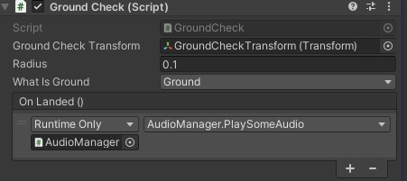

# Unity-GroundCheck
Dynamic Ground Check Script for game objects in Unity.

https://youtu.be/bJ9XzZC9ELE

--Implementation--
1- Download GroundCheck.cs and GroundCheck.cs.meta files.
2- Move files to Assets folder of your Unity project.
3- Open your Unity project.
3- Add GroundCheck.cs to object that you want to implement.
4- Add an empty game object to your game object.
5- Move object that we just created to wherever you want to check is your object on ground.
6- In Inspector set object as GroundCheckTransform.
7- Set radius value like 0.1f.
8- Add a new layer from top right corner on Unity engine.
9- Then set whatIsGround to that layer.
10- Set layer of your ground object to that layer.
11- If you want to do something when object landed like playing audio You can set an event to GroundCheck.OnLanded in inspector.

